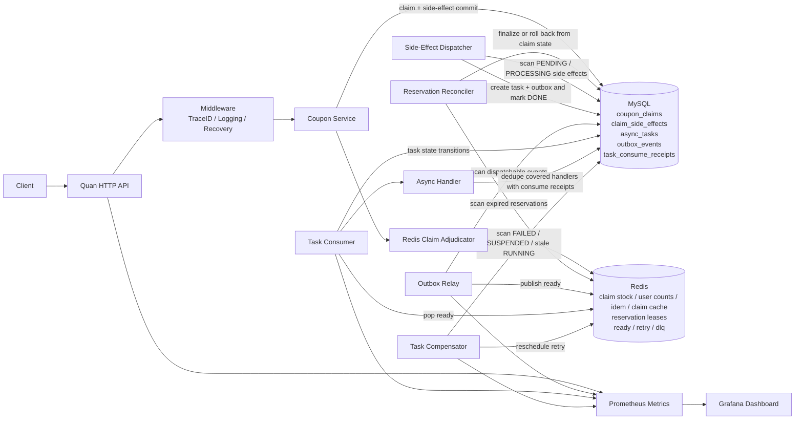

# Architecture Diagram

## Notes

- correctness boundary: MySQL committed state
- hot-path adjudication: Redis claim decision, claim cache, and reservation keys
- hot async transport: Redis queue keys
- reliability mechanisms: reservation reconciler + side-effect dispatcher +
  outbox relay + task consumer + compensator
- covered handler dedupe: `task_consume_receipts` for handlers that record
  unique consume receipts
- observability path: HTTP metrics + business metrics + relay/consumer/
  compensator metrics; dispatcher and reconciler are not separately instrumented
  yet
