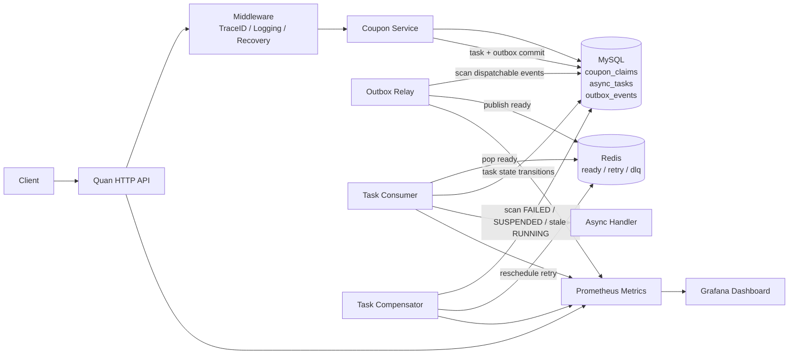

# Architecture Diagram

## Notes

- correctness boundary: MySQL committed state
- hot async transport: Redis queue keys
- reliability mechanisms: outbox relay + task consumer + compensator
- observability path: HTTP metrics + business metrics + async recovery metrics
